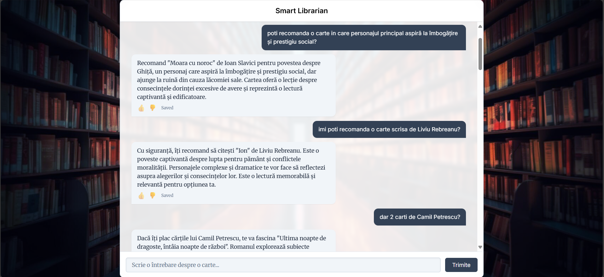
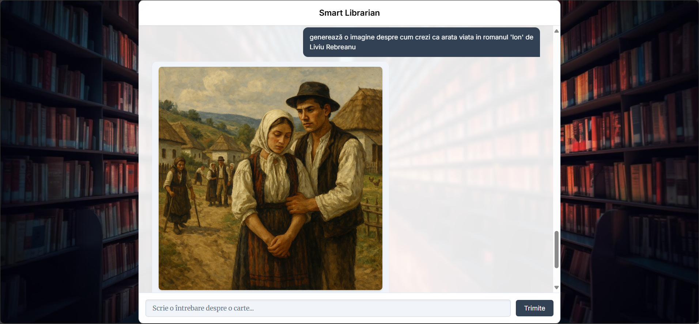

# 📚 Smart Librarian (RAG)

Smart Librarian is a full-stack application that uses **Retrieval-Augmented Generation (RAG)** to recommend books based on user queries.  
It supports **feedback-based caching** and now includes **conditional image generation** for visualizing scenes, characters, or settings from books.

## ✨ Features
- **Book Recommendations**: Uses embeddings + vector search (ChromaDB) to find the most semantically relevant books.
- **Feedback-Based Cache**: Stores responses in PostgreSQL, replaying only liked entries.
- **Fuzzy Matching**: Falls back to trigram similarity search for near matches.
- **Conditional Image Generation**:  
  - Detects when the user asks for an image (English & Romanian trigger phrases).  
  - Generates illustrations using OpenAI's image API (`gpt-image-1` or `dall-e-3` fallback).  
  - Caches generated images for reuse.
- **Frontend Integration**: Displays either text recommendations or generated images with thumbs-up/down feedback.
- **Multilingual Support**: Works with English and Romanian book queries.

## 🏗 Tech Stack
**Backend**:
- [FastAPI](https://fastapi.tiangolo.com/) (Python)
- [ChromaDB](https://docs.trychroma.com/) for vector search
- [PostgreSQL](https://www.postgresql.org/) for caching
- [OpenAI API](https://platform.openai.com/) for LLM + image generation

**Frontend**:
- [React](https://react.dev/) + [Vite](https://vitejs.dev/)
- [TypeScript](https://www.typescriptlang.org/)
- [Tailwind CSS](https://tailwindcss.com/)

## 📸 Screenshots

### 💬 Text Recommendation Example

### 🖼 Image Generation Example

